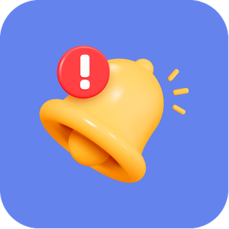
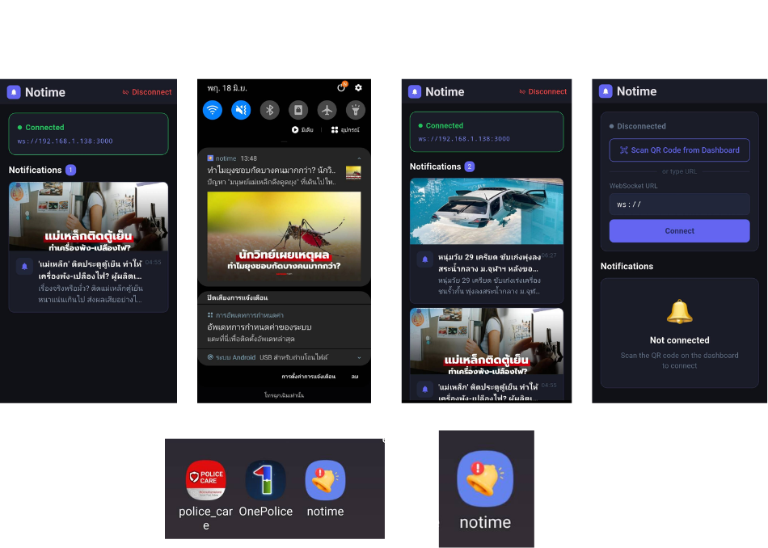

# 🔔 Notime

<div align="center">



### Real-time Notification Testing Platform

ส่ง Notification จาก Website Dashboard ไปยัง Flutter Application ผ่าน WebSocket แบบ Real-time

</div>

---

## 📖 Overview

**Notime** เป็นโปรเจกต์สำหรับทดสอบระบบส่งการแจ้งเตือน (Notification) แบบ Real-time

ผู้ใช้งานสามารถส่งข้อมูลจาก **Website Dashboard** ไปยัง **Flutter Mobile Application** ผ่าน **Node.js Server** โดยใช้ **WebSocket** เป็นตัวกลางในการสื่อสาร

เหมาะสำหรับการศึกษาแนวทางการทำงานของ

- WebSocket
- Real-time Communication
- Push Notification Simulation
- Flutter Local Notification
- Dashboard Management

---

## 🏗 Architecture

```text
[Web Dashboard]  ←→  [Node.js Server]  ←→  [Flutter App]
    Browser             Port 3000          Mobile Device
```

ระบบทั้งหมดประกอบด้วย

### 1. Web Dashboard
- สร้างและส่ง Notification
- กรอก Title
- กรอก Message
- แนบ URL รูปภาพ
- แสดงประวัติการส่ง Notification
- แสดง QR Code สำหรับเชื่อมต่อ Mobile App

### 2. Node.js Server
- รับคำสั่งจาก Dashboard
- จัดการ WebSocket Connection
- ดาวน์โหลดและแปลงรูปภาพ
- กระจายข้อมูลไปยังทุก Client ที่เชื่อมต่อ

### 3. Flutter Application
- เชื่อมต่อ WebSocket
- รับ Notification แบบ Real-time
- ดาวน์โหลดรูปภาพ
- แสดง Local Notification
- เก็บประวัติ Notification

---

# 📱 Application Preview
<div align="center">


---

<div align="center">
# 🌐 Website Preview


---

# 🔌 Communication Method

## Why WebSocket?

โดยปกติ HTTP จะทำงานแบบ

```text
Request → Response → Close
```

แต่ WebSocket จะ

```text
Open Connection
        ↓
ส่งข้อมูลได้ตลอดเวลา
        ↓
รับข้อมูลได้ตลอดเวลา
```

ทำให้เหมาะสำหรับระบบ Notification แบบ Real-time

---

## Flutter Connection

Flutter จะเปิดการเชื่อมต่อไปยัง Server

```text
ws://192.168.1.138:3000
```

```text
Flutter App
      │
      ▼
WebSocket Connection
      │
      ▼
Node.js Server
```

ทุกครั้งที่เปิดแอป

- กด Connect
- หรือ Scan QR Code

เพื่อเปิด WebSocket Connection

---

# 🚀 Notification Flow

```text
① User กรอกข้อมูลใน Website Dashboard
        ↓
② Browser ส่ง HTTP POST /send
        ↓
③ Node.js Server รับข้อมูล
        ↓
④ Download และแปลงรูปภาพเป็น JPEG
        ↓
⑤ ส่ง JSON ผ่าน WebSocket
        ↓
⑥ Flutter รับข้อมูล
        ↓
⑦ Download รูปจาก Server
        ↓
⑧ แสดง Notification บนมือถือ
```

---

# 📦 Notification Payload

Server จะส่งข้อมูลในรูปแบบ JSON ผ่าน WebSocket

```json
{
  "type": "notification",
  "id": 1718683200000,
  "title": "หัวข้อ",
  "body": "ข้อความ",
  "imageUrl": "http://192.168.1.138:3000/img/img_xxx.jpg",
  "timestamp": "2026-06-18T10:00:00.000Z"
}
```

---

# 📲 Flutter Processing

Flutter รับข้อมูลในไฟล์

```text
notification_service.dart
```

ผ่านฟังก์ชัน

```dart
_onMessage()
```

ขั้นตอนการทำงาน

```text
Receive JSON
      ↓
Convert to NotificationItem
      ↓
Download Image
      ↓
Show Local Notification
```

---

# 🖼 Image Handling

Server จะไม่ส่ง URL ต้นทางไปยัง Flutter โดยตรง

ตัวอย่าง URL ต้นทาง

```text
https://example.com/image.webp
```

Server จะ

```text
Download Image
       ↓
Convert to JPEG
       ↓
Store in public/img/
       ↓
Generate Local URL
```

ตัวอย่าง

```text
http://192.168.1.138:3000/img/img_xxx.jpg
```

ข้อดี

- รองรับ WebP
- รองรับ CDN ต่าง ๆ
- ลดปัญหาการโหลดรูปจากภายนอก
- Flutter ดึงรูปจาก Local Server ได้ทันที

---

# 🌍 Network Requirement

อุปกรณ์ทุกตัวต้องอยู่ในเครือข่ายเดียวกัน

```text
มือถือ ───── WiFi ─────┐
                        ├── Router
คอมพิวเตอร์ ─ WiFi ────┘
```

เนื่องจากใช้ Local IP

```text
ws://192.168.1.x:3000
```

หากอยู่คนละเครือข่ายจะไม่สามารถเชื่อมต่อได้

---

# ⚙️ Features

### Website Dashboard

- Send Notification
- Notification History
- QR Code Connection
- Connected Device Counter
- Real-time Monitoring

### Flutter Application

- WebSocket Client
- QR Code Scanner
- Local Notification
- Notification History
- Image Notification Support
- Connection Status Display

### Node.js Server

- WebSocket Server
- HTTP API
- Image Proxy
- Image Conversion
- Broadcast Notification

---

# 🛠 Technology Stack

### Frontend

- Flutter
- Dart

### Backend

- Node.js
- Express.js
- WebSocket (ws)

### Communication

- WebSocket
- HTTP REST API

### Notification

- Flutter Local Notifications

---

# 📋 Future Improvements

- Authentication
- Multiple Channels
- Scheduled Notifications
- Push Notification (FCM)
- User Groups
- Cloud Deployment
- Notification Analytics

---

# 📄 License

This project is created for educational and testing purposes.

---

<div align="center">

Made with ❤️ using Flutter + Node.js

</div>
